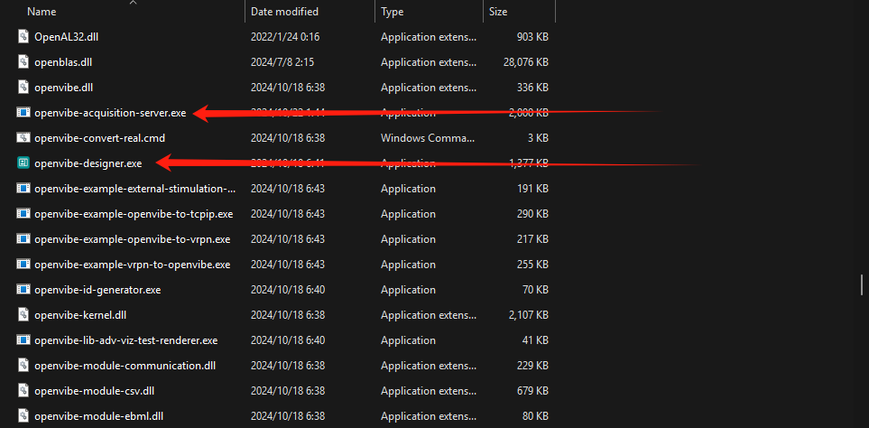

# EEG-Brainwave-Controlled-RaceCar
Utilize the 14-channel EPOC+ Model 1.1 EEG device to collect brainwave data and classify motor imagery data to control an F1TENTH Race Car. This project emphasizes precise experimentation, iterative trials, thorough testing, and strict safety measures.


https://github.com/user-attachments/assets/a83ca752-6628-483c-a997-53208fd21c4c


# Repo Structure
- Dataset: The HCI-BCI team's binary classification task recording data (left vs right only). For pretraining and designing for our multi-class tasks workflow
- Documentation and OpenViBE folders: Source file ad documentation for how we set up the EEG recording and streaming system
- Self-Recorded-Data: 5 trials of 5-minute 4-class motor imagery data recording (4 for training 1 for validation). The scripts to basically process the raw EEG data in the csv to trainable and testable csv format data are included.
- Train: The folder contains initial model and real time simulation with whole data processing and high accuracy for stationary EEG classifications(98%) but poor real-time accuracy (26%).
- Train_realtime_experiments: Enhanced model with trials of experiments for different parameters (batch, windows, learning rate, weight decay, etc.) and its real time simulation tests. The model receives lowever offline training accuracy (85-86%) but improved online real-time accuracy to ~50% (compared to typical 28% for multiclass online classifications).
- final_deployment: The folder contains the final model used and the server client framework for the physical control over the F1TENTH racecar.
- stimulation.py: the real-time recording script for our self-recorded data with real-time visual stimulation, labeling, and timestamping functions. 
  
# Cotent List

- [EEG-Brainwave-Controlled-RaceCar](#eeg-brainwave-controlled-racecar)
- [EEG Device Preparation (EPOC+)](#eeg-device-preparation-epoc)
  - [Step 1: Download the EMOTIV Launcher](#step-1-download-the-emotiv-launcher)
  - [Step 2: Connect the USB Dongle](#step-2-connect-the-usb-dongle)
  - [Step 3: Verify the Device Connection](#step-3-verify-the-device-connection)
  - [Step 4: Access Device Settings](#step-4-access-device-settings)
- [OpenVibe Preparation](#openvibe-preparation)
  - [Step 1: Obtain OpenVibe](#step-1-obtain-openvibe)
  - [Step 2: Download OpenVibe](#step-2-download-openvibe)
  - [Step 3: Install OpenVibe](#step-3-install-openvibe)
- [Data Recording Preparation](#data-recording-preparation)
  - [Step 1: Clone the CyKit Repository](#step-1-clone-the-cykit-repository)
  - [Step 2: Modify the `eeg.py` File](#step-2-modify-the-eegpy-file)
  - [Step 3: Run CyKit](#step-3-run-cykit)
- [Connecting Python CyKit to OpenVibe](#connecting-python-cykit-to-openvibe)
  - [Step 1: Navigate to the OpenVibe Folder](#step-1-navigate-to-the-openvibe-folder)
  - [Step 2: Locate and Open Required Executables](#step-2-locate-and-open-required-executables)
  - [Step 3: Configure the OpenVIBE Acquisition Server](#step-3-configure-the-openvibe-acquisition-server)
- [Creating a Scenario in OpenVibe Designer](#creating-a-scenario-in-openvibe-designer)
  - [Step 7: Start Everything](#step-7-start-everything)
  - [Step 8: Success](#step-8-success)
  - [Step 9: Really](#step-9-really)


https://github.com/user-attachments/assets/4fa1a5a8-98fc-4b8b-8a99-31b610fd2b0a


Video 1 - Successfull EEG device realtime data visualization connection - Demo 0.0

## EEG Device Preparation (EPOC+)
Before starting the project, ensure the EPOC+ device is properly configured. Follow these detailed steps to prepare your device for reliable brainwave data collection.

### Steps for Configuration

#### **Step 1: Download the EMOTIV Launcher**
To interface with the EPOC+ device, you need the EMOTIV Launcher. Follow the instructions below to download and install it:

1. Open the official EMOTIV Launcher download page:  
   [Download EMOTIV Launcher](https://www.emotiv.com/pages/download-emotiv-launcher)

2. Choose the correct version for your operating system (Windows or Mac).

3. Download and install the software by following the on-screen prompts.

4. Once installed, launch the EMOTIV Launcher to ensure the application runs correctly.

For quick reference, the direct URL is:
```bash
https://www.emotiv.com/pages/download-emotiv-launcher
```

#### **Step 2: Connect the USB Dongle**
To enable communication between the EPOC+ device and your computer:

1. Insert the USB dongle included with the EPOC+ device into an available USB port on your computer.

2. Verify the connection by checking the dongle’s indicator light, which should illuminate when properly connected.

3. If the light does not appear:
   - Ensure the dongle is inserted securely.
   - Try using a different USB port.

**Visual Reference:**  


#### **Step 3: Verify the Device Connection**
Once the USB dongle is connected, verify that the EPOC+ device is recognized by the EMOTIV Launcher:

1. Open the EMOTIV Launcher application.

2. Check the device status displayed in the interface. A successful connection will show the device as **Connected**.

3. If the status shows **Not Connected**:
   - Confirm the dongle is properly inserted.
   - Ensure the EPOC+ device is powered on.

**Visual Reference:**  


#### **Step 4: Access Device Settings**
After ensuring the connection, configure the device for optimal performance:

1. Locate and click the **Settings** button at the top-left corner of the EMOTIV Launcher interface.

2. Configure the following key settings:
   - **Channel Calibration**: Ensure all channels are functioning correctly.
   - **Battery Status**: Confirm the device has sufficient charge.
   - **Signal Quality**: Optimize signal clarity by adjusting placement or environment if necessary.

3. At this stage, you may skip advanced configurations unless they are specifically required for your project.

**Visual Reference:**  


## OpenVibe Preparation
OpenVibe is a powerful tool used to receive, display, and process EEG data in real time. It supports saving data in various file formats, such as `.CSV`, `.OV`, and `.dat`. Follow the steps below to prepare OpenVibe for use with your project.

---

### Steps for Configuration

#### **Step 1: Obtain OpenVibe**
You can use the provided folder `openvibe-3.6.0-64bit` or download the latest version directly from the official website:

1. Visit the OpenVibe downloads page:  
   [Go to OpenVibe Downloads](https://openvibe.inria.fr/downloads/)

2. Alternatively, you can use the direct link below if needed:
   ```bash
   https://openvibe.inria.fr/downloads/
    ```

#### **Step 2: Download OpenVibe**
To download OpenVibe:

1. Visit the official OpenVibe downloads page:  
   [Go to OpenVibe Downloads](https://openvibe.inria.fr/downloads/)

2. On the downloads page, select the appropriate version of OpenVibe for your operating system (e.g., Windows, Mac, or Linux).

3. Click the download button to start the download process.

**Visual Reference:**  


#### **Step 3: Install OpenVibe**
Once the OpenVibe installer is downloaded:

1. Locate the installer file in your downloads folder (e.g., `openvibe-x.x.x-64bit.exe`).
2. Double-click the installer to start the installation process.
3. Follow the on-screen instructions provided by the installer.
   - Use the default installation settings unless specific configurations are required.
4. Complete the installation by clicking **Finish** when prompted.

> **Note:** There are no special steps during the installation—just follow the standard procedure.

After installation, OpenVibe will be ready to use.

## Data Recording Preparation
To record EEG data, we will use the open-source repository [CyKit](https://github.com/CymatiCorp/CyKit). Follow the steps below to set up and configure CyKit for your project.

---

### Steps for Configuration

#### **Step 1: Clone the CyKit Repository**
Use `git` to clone the CyKit repository to your local machine:

1. Open your terminal or command prompt.
2. Run the following command:
   ```bash
   git clone https://github.com/CymatiCorp/CyKit
   ```

#### **Step 2: Modify the `eeg.py` File**  
CyKit requires a specific change in the `eeg.py` file to ensure compatibility with your system.  

1. Navigate to the following file in your cloned repository:  
    ```plaintext  
    CyKit\Py3\eeg.py  
    ```  

2. Open the file in your preferred text editor.  

3. Locate **line 1088**. Before making any changes, determine your system's architecture by running the following command in your terminal:  
    ```bash  
    python -c "import platform; print(platform.architecture())"  
    ```  

4. Example output:  
    ```bash  
    PS D:\Code\EEG_Project> python -c "import platform; print(platform.architecture())"  
    ('64bit', 'WindowsPE')  
    ```  

5. Update **line 1088** in the `eeg.py` file as follows:  
    - Original line:  
      ```python  
      backend = cyPyUSB.backend.libusb1.get_backend(find_library=lambda x: "./cyDrivers/libusb-1.0x" + str(arch) + ".dll")  
      ```  
    - Change it to:  
      ```python  
      backend = cyPyUSB.backend.libusb1.get_backend(  
          find_library=lambda x: "D:\\Code\\cykit\\CyKit\\Py3\\cyDrivers\\libusb-1.0x64.dll"  
      )  
      ```  

6. Save the file after making the changes.  

This modification ensures that the CyKit library correctly locates the required USB backend DLL file.  

#### **Step 3: Run CyKit**  
After completing the modifications, start CyKit to begin recording EEG data.  

1. Open your terminal or command prompt.  

2. Navigate to the CyKit directory:  
    ```bash  
    cd D:\Code\cykit\CyKit  
    ```  

3. Execute the following command:  
    ```bash  
    D:\Python39\python.exe .\Py3\CyKIT.py 127.0.0.1 5500 6 openvibe+generic+nocounter+noheader+nobattery+ovdelay:100+float  +ovsamples:004  
    ```  

4. If successful, you will see output similar to the following:  
    ```bash  
    PS D:\Code\cykit\CyKit> D:\Python39\python.exe .\Py3\CyKIT.py 127.0.0.1 5500 6 openvibe+generic+nocounter+noheader+nobattery    +ovdelay:100+float+ovsamples:004  
    > USB Device (No Additional Information)  
    > USB Device (No Additional Information)  
    > USB Device (No Additional Information)  
    > USB Device (No Additional Information)  
    > USB Device (No Additional Information)  
    > USB Device (No Additional Information)  
    > USB Device (No Additional Information)  
    > USB Device (No Additional Information)  
    
    > Found EEG Device [EEG Signals]  
    
    > USB Device (No Additional Information)  
    ══════════════════════════════════════════════════  
    
    > Listening on 127.0.0.1 : 5500  
    > Trying Key Model #: 6  
    (-) Connecting . . .  
    ```  

## Connecting Python CyKit to OpenVibe  
This process is critical and must be handled carefully. Follow each step precisely to ensure a successful connection between Python CyKit and OpenVibe.  

### Steps for Configuration  

#### **Step 1: Navigate to the OpenVibe Folder**  
Go to the folder where OpenVibe is installed:  
    ```bash  
    D:\openvibe-3.6.0-64bit\bin  
    ```  

#### **Step 2: Locate and Open Required Executables**  
Find the following executable files and open them one by one:  
- `openvibe-designer.exe`  
- `openvibe-acquisition-server.exe`  

**Visual Reference:**  
  

#### **Step 3: Configure the OpenVIBE Acquisition Server**  
In the OpenVIBE Acquisition Server application:  
- Select **Generic Raw Telnet Reader** as the driver.  
- Set the **Connection Port** to `1024` (a local port for OpenVIBE Designer to connect to).  
- Keep the **Sample count per sent block** set to `4` (default). This determines how many samples CyKIT sends before OpenVIBE processes them.  

(Optional: To modify the sample count, refer to the additional configuration section below.)  

**Visual Reference:**  
  

#### **Step 4: Adjust Driver Properties for Generic Raw Telnet Reader**  
In the Driver Properties window, configure the settings as follows:  
- **Number of channels:** 14  
- **Sampling frequency:** 128 (or 256 for EPOC+ in 256Hz mode)  
- **Telnet host name:** localhost  
- **Telnet host port:** 5151 (local port for CyKIT.py server)  
- **Endianess:** Big Endian  
- **Sample type:**  
  - `32 bits float` (if CyKIT.py is using the `+float` parameter)  
  - `16 bits unsigned integer` (if CyKIT.py is using the `+integer` parameter)  
- **Skip at start (bytes):** 0  
- **Skip header (bytes):** 0  
- **Skip footer (bytes):** 0  

Click the **Apply** button to save changes.  
Then, click the **Connect** button to link OpenVIBE to the CyKIT.py server. Ensure that CyKIT.py is already running.  

**Visual Reference:**  
  

#### **Step 5: Verify Configuration Success**  
After completing all configurations, verify that the setup is successful. You should see the following confirmation:  

**Visual Reference:**  
  


#### **Step 6: Create a Scenario in OpenViBE Designer**
In OpenViBE Designer, we will create a scenario by dragging and dropping functions into the workspace.

1. **Drag and drop components:**
   - **Acquisition Client:** From `[-] Acquisition and network IO`, drag and drop it into the workspace on the left.
   - **Signal Display** and **Matrix Display:** From `[-] Visualization [-] Basic`, drag and drop them into the workspace.

2. **Connect components:**
   - Hover over the **pink arrow** on the `Acquisition Client` (indicating `Signal Stream [signal]`) and drag a line from that arrow to the **green arrow** on `Matrix Display`.
   - Hover over the **pink arrow** on the `Acquisition Client` (indicating `Signal Stream [signal]`) and drag a line from that arrow to the **pink arrow** labeled `Data [Signal]` on `Signal Display`.

3. **Configure the `Acquisition Client`:**
   - Double-click the `Acquisition Client` and replace `${AcquisitionServer_HostName}` with the text: `localhost`.
   - Ensure the **Acquisition server port** is set to `1024` (unless you changed it in the Acquisition Server).
   - Click **Apply** to save the `Acquisition Client` settings.

4. **Optional: Save the file**
   - To save the output, search for the `File Writer` component. We recommend using the `CSV File Writer`.

Below is a screenshot of the configuration process:

**Visual Reference:**  


#### **Step 7: Start Everything**

1. **Start the Server:**
   - Navigate to the **Server** window and click the **play button**.
   - **Visual Reference:**  
     

2. **Start the Designer:**
   - Navigate to the **Designer** window and click the **play icon**.
   - **Visual Reference:**  
     

#### **Step 8: Success**

Once everything is running, you can see the result
**Visual Reference:**  


#### **Step 9: Really**

Are you sure you *really* still want Step 9??? 🤔

If so, congratulations! You've officially completed **Step 8** and are ready for... something mysterious in **Step 9**. 🎉

But seriously, take a moment to appreciate your hard work so far. If Step 9 truly exists, maybe it’s just to remind you to **double-check everything** and make sure all configurations are in place. 😊
